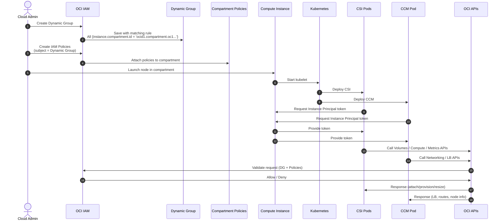

# Configuring IAM for OCI CSI Driver and CCM

The **OCI Container Storage Interface (CSI) driver** and the **OCI Cloud Controller Manager (CCM)** must authenticate to the Oracle Cloud Infrastructure (OCI) APIs in order to manage block volumes, volume attachments, and node metadata.  

Instead of storing credentials inside Kubernetes secrets, the recommended approach is to use **Instance Principals**.  
This allows OCI Compute instances (your Kubernetes/OKD nodes) to directly call OCI APIs securely, using their identity.

To enable this, you must create:

1. A **Dynamic Group** that includes your cluster nodes.
2. **IAM Policies** granting that group the required permissions.

---

## 🧑‍🤝‍🧑 Create a Dynamic Group

A **Dynamic Group** lets you group OCI resources (here: Compute instances) based on rules, instead of static membership.  
All instances in the group automatically gain the permissions granted to it.

Steps:
1. In the OCI Console, go to **Identity & Security → Dynamic Groups**.
2. Click **Create Dynamic Group**.
3. Provide:
   - **Name:** `okd-nodes-dg`
   - **Description:** `Dynamic Group for Kubernetes/OKD nodes`
   - **Matching Rule:**  
     ```text
     ALL {instance.compartment.id = 'ocid1.compartment.oc1..aaaa...'}
     ```
     Replace the compartment OCID with the one where your nodes are running.

⚠️ **Important:**  
Attach the Dynamic Group to the **same IAM domain (tenancy)** where your cluster compartment resides.

---

## 🛡️ Create IAM Policies

Next, create an **IAM Policy** to allow this Dynamic Group to use required services.

Steps:
1. In the OCI Console, go to **Identity & Security → Policies**.
2. Create a new policy in the compartment where your cluster resources are running.
3. Add the following statements:

```text
Allow dynamic-group okd-nodes-dg to use volume-family in compartment <your-compartment>
Allow dynamic-group okd-nodes-dg to use instance-family in compartment <your-compartment>
Allow dynamic-group okd-nodes-dg to read metrics in compartment <your-compartment>
Allow dynamic-group okd-nodes-dg to manage volume-attachments in compartment <your-compartment>
```

- volume-family → create/delete/attach/detach block volumes
- instance-family → read node metadata (required by CCM)
- metrics → read metrics for autoscaling/monitoring
- volume-attachments → attach/detach block volumes to nodes

  ---

  ## ✅ Result

  Once the Dynamic Group and Policies are configured:
  - The CSI driver can dynamically provision block volumes for Persistent Volumes.
  - The CCM can manage node metadata and load balancers.
  - No secrets with API keys are required; authentication happens through Instance Principals.
 
    ---

## 📚 References

- [Creating a Dynamic Group](https://docs.oracle.com/en-us/iaas/Content/Identity/dynamicgroups/To_create_a_dynamic_group.htm?Highlight=Dynamic%20Group)

---
<table>
<tr style="border: 0px transparent">
	<td style="border: 0px transparent"><a href="../README.md" title="home">🏠</a></td>
</tr>
</tr>

</table>