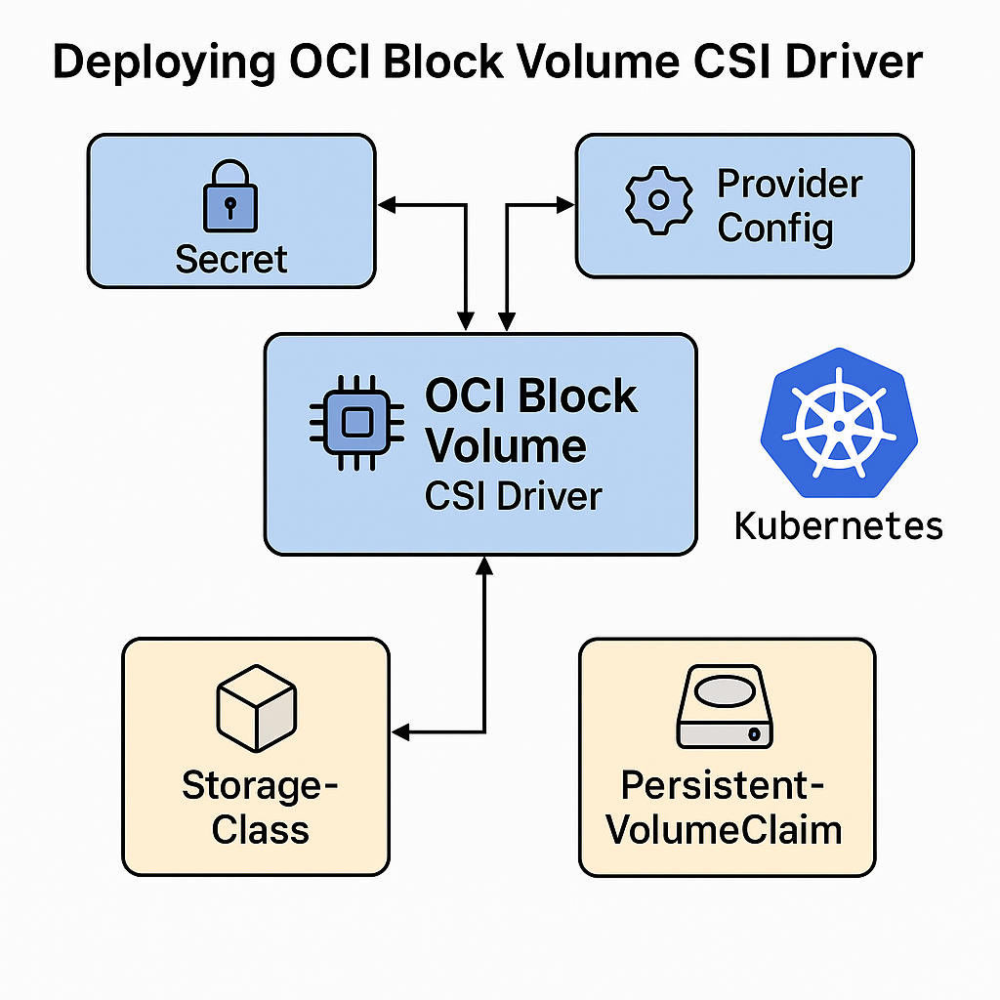

# Deploying OCI Block Volume CSI Driver on Kubernetes / OpenShift

This guide explains how to deploy the **Oracle Cloud Infrastructure (OCI) Block Volume CSI driver** on a Kubernetes or OpenShift cluster running on OCI, using YAML manifests only 
Before deploying the **OCI Container Storage Interface (CSI) Driver**, make sure the following prerequisites are satisfied.


---

## 📝 Prerequisites

- A running Kubernetes or OpenShift cluster in **OCI**.
- The **OCI Cloud Controller Manager (CCM)** is already deployed (`oci-cloud-controller-manager`).
- The cluster nodes run in OCI and have permissions via **Instance Principals** (Dynamic Group + Policies).
- `kubectl` or `oc` configured to access your cluster.

---

## ⚙️ Adding Region and Availability Domain Labels to Nodes

The OCI Block Volume CSI driver relies on Kubernetes node labels to determine in which **region** and **availability domain (AD)** the cluster is running.  
If these labels are missing, the driver cannot place volumes correctly and PVC provisioning will fail with topology errors.
You must add these labels to **all nodes in the cluster**
You can manually label your nodes with the required values (replace with your own region/AD):

```bash
# Example for a node named okd01
oc label node okd01 topology.kubernetes.io/region=us-ashburn-1
oc label node okd01 topology.kubernetes.io/zone=us-ashburn-1-AD-1
```

After applying these labels, verify with:

```bash
oc get nodes --show-labels | grep topology
```


## ⚙️ Create Provider Configuration

The CSI driver needs a provider configuration to talk to OCI APIs.  
Create a file called `provider-config.yaml`:

📄 provider-config.yaml
```yaml
kind: CloudProviderConfig
apiVersion: oci.cloud.oracle.com/v1alpha1
auth:
  useInstancePrincipals: true
  region: us-ashburn-1                # Replace with your region
compartmentOcid: ocid1.compartment.oc1..example12345 # Replace with your comportment OCID
```

---

## 🔑 Create the Secret for the CSI Driver

The CSI driver looks for a secret named `oci-volume-provisioner` in the `kube-system` namespace.  
Create it from the provider config:

```bash
kubectl -n kube-system create secret generic oci-volume-provisioner \
  --from-file=config.yaml=provider-config.yaml
```

---

## 🚀 Deploy CSI Controller and Node Plugins

Apply the manifests for the latest release (example: **v1.33.0**):

```bash
kubectl apply -f https://github.com/oracle/oci-cloud-controller-manager/releases/download/v1.33.0/oci-csi-controller.yaml
kubectl apply -f https://github.com/oracle/oci-cloud-controller-manager/releases/download/v1.33.0/oci-csi-node.yaml
```

Verify that pods are running:

```bash
kubectl -n kube-system get pods | grep csi-oci
```

You should see:
- `csi-oci-controller-...` in **7/7 Running**
- `csi-oci-node-...` in **4/4 Running**

---

## 🗂️ Create a StorageClass

Create a StorageClass to provision OCI Block Volumes:

📄 create_storage_class.yaml
```yaml
apiVersion: storage.k8s.io/v1
kind: StorageClass
metadata:
  name: oci-bv
provisioner: blockvolume.csi.oraclecloud.com
parameters:
  csi.storage.k8s.io/fstype: xfs
  vpusPerGB: "10"                   # Performance tier: 0, 10, 20, 30
  attachmentType: "paravirtualized" # or "iscsi" if required
reclaimPolicy: Delete
volumeBindingMode: WaitForFirstConsumer
allowVolumeExpansion: true
allowedTopologies:
  - matchLabelExpressions:
      - key: topology.kubernetes.io/region
        values:
          - us-ashburn-1
      - key: topology.kubernetes.io/zone
        values:
          - us-ashburn-1-AD-1
```

Apply it:

```bash
kubectl apply -f sc-oci-bv.yaml
```

---

## 📦 Test with a PVC

We will start by creating a test project:

📄 create_project.sh
```bash

oc new-project tests

```

Create a test PersistentVolumeClaim (PVC):

📄 create_pvc.yaml
```yaml
apiVersion: v1
kind: PersistentVolumeClaim
metadata:
  name: pvc-test
spec:
  accessModes: ["ReadWriteOnce"]
  resources:
    requests:
      storage: 10Gi
  storageClassName: oci-bv
```

Apply it:

```bash
oc -n tests apply -f create_pvc.yaml

NAME       STATUS    VOLUME   CAPACITY   ACCESS MODES   STORAGECLASS   VOLUMEATTRIBUTESCLASS   AGE
pvc-test   Pending                                      oci-bv         <unset>                 1m

```
The PVC shows as Pending since it has no capacity assigned yet. It will only be provisioned once a pod starts using it,

Create a test POD :

📄 create_pods.yaml
```yaml
apiVersion: v1
kind: Pod
metadata:
  name: pod-using-pvc
  namespace: tests
spec:
  securityContext:
    runAsNonRoot: true
    runAsUser: 1001
    fsGroup: 1001
    fsGroupChangePolicy: OnRootMismatch
    seccompProfile:
      type: RuntimeDefault
  containers:
    - name: nginx
      image: nginxinc/nginx-unprivileged:1.25-alpine
      ports:
        - containerPort: 8080
      volumeMounts:
        - name: test-storage
          mountPath: /usr/share/nginx/html
      securityContext:
        allowPrivilegeEscalation: false
        capabilities:
          drop: ["ALL"]
        readOnlyRootFilesystem: false
  volumes:
    - name: test-storage
      persistentVolumeClaim:
        claimName: pvc-test
```

```bash
oc -n tests apply -f create_pods.yaml

```

---

## ✅ Summary

1. Create a provider configuration (`provider-config.yaml`).
2. Store it in a Kubernetes secret `oci-volume-provisioner` (namespace `kube-system`).
3. Deploy CSI Controller and Node manifests.
4. Create a StorageClass using the CSI provisioner.
5. Test with a PVC to confirm block volume provisioning.

With this setup, your cluster can dynamically provision and attach OCI Block Volumes to workloads.

---

## 📚 References

- [oci-cloud-controller-manager](https://github.com/oracle/oci-cloud-controller-manager)

---
<table>
<tr style="border: 0px transparent">
	<td style="border: 0px transparent"><a href="../README.md" title="home">🏠</a></td>
</tr>
</tr>

</table>