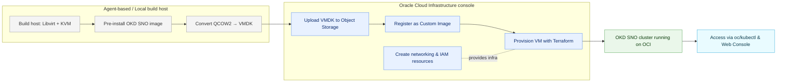

  
# 🚀 Deploying OpenShift Single Node (OKD) on Oracle Cloud Infrastructure (OCI)


## 📘 Introduction
This guide describes how to deploy a **test OpenShift platform** in **OCI** using the **open-source OKD distribution**.  
We are not using the standard OpenShift deployment procedure (discovery ISO boot), since OCI does not support direct ISO boot.  

Instead, we will:  
- Pre-install an OKD Single Node (SNO) image on a VM running locally with **libvirt + KVM**,  
- Convert it to a **custom image** compatible with OCI,  
- Upload it to Object Storage and register it as a custom image,  
- Finally, deploy the VM with **Terraform**.
---

## 📊 Architecture Diagram



---

## 📋 Prerequisites
- An **OCI account** with appropriate IAM access.
- An [**RedHat  account**](https://sso.redhat.com/auth/realms/redhat-external/protocol/openid-connect/auth?client_id=cloud-services&redirect_uri=https%3A%2F%2Fconsole.redhat.com%2Fopenshift%2Finstall%2Fpull-secret&response_type=code&scope=openid+api.console+api.ask_red_hat&nonce=4fa08d33-e0c6-434e-8ede-007b4650f86a&state=4f2dda0f64694f73a28a0cf04c11eff1&response_mode=fragment)
- A **VCN 
- An **Object Storage bucket** for custom image upload.  
- A **Linux build host** with:
  - 10 vCPU / 48 GB RAM minimum  
  - 500 GB of free disk space  
  - Packages: `qemu-kvm`, `libvirt`, `virt-install`, `virt-manager`, `libvirt-client`, `podman`  , `nmstate`
- Installed tools: and copy this binary in /usr/bin directory
  - [`terraform`](https://developer.hashicorp.com/terraform/downloads)  
  - `kubectl` or `oc` CLI  
  - `htpasswd`
  - `OCI Client`(https://www.oracle.com/database/technologies/instant-client/downloads.html)

Before starting, make sure to clone the repository:
```bash
git clone https://github.com/colussim/okd-single-node-oci-deploy.git  
cd okd-single-node-oci-deploy  
```
---

## 🛠️ Step 1 – Install Dependencies

```bash
sudo dnf install -y qemu-kvm libvirt virt-install virt-manager libvirt-client podman jq nmstate
```

## 🛠️ Step 2 – Prepare OKD Artifacts

```bash
export OKD_VERSION=4.19.0-okd-scos.15
export ARCH=x86_64   # or aarch64
```

Download the OKD client:
```bash
curl -L https://github.com/okd-project/okd/releases/download/$OKD_VERSION/openshift-client-linux-$OKD_VERSION.tar.gz -o oc.tar.gz

tar zxf oc.tar.gz
chmod +x oc
```

Download the OKD installer:
```bash
curl -L https://github.com/okd-project/okd/releases/download/$OKD_VERSION/openshift-install-linux-$OKD_VERSION.tar.gz -o openshift-install-linux.tar.gz

tar zxvf openshift-install-linux.tar.gz
chmod +x openshift-install
```

Get the latest SCOS QCOW2 image:

👉 This will give you the official URL of the latest compressed QCOW2 for SCOS/FCOS.

Download it using:
```bash
curl -L -o scos.qcow2.gz "$(./openshift-install coreos print-stream-json | jq -r '.architectures.x86_64.artifacts.qemu.formats."qcow2.gz".disk.location')"
```

---

## 🛠️ Step 3 – Configure Cluster Install Files

Prepare **install-config.yaml** and **agent-config.yaml **with your cluster name, domain, SSH keys, and network details.
(see examples in this repo under /examples/)

You need two configuration files: install-config.yaml and agent-config.yaml.

📄 install-config.yaml
```yaml
apiVersion: v1
baseDomain: mysqllab.com
metadata:
  name: okdk8s
controlPlane:
  name: master
  replicas: 1
  hyperthreading: Enabled
  architecture: amd64
compute:
- name: worker
  replicas: 0
  hyperthreading: Enabled
  architecture: amd64
networking:
  networkType: OVNKubernetes
  clusterNetwork:
  - cidr: 10.128.0.0/14
    hostPrefix: 23
  serviceNetwork:
  - 172.30.0.0/16
  machineNetwork:
  - cidr: 10.0.30.0/24
platform:
  none: {}
pullSecret: '<pull_secret>'
sshKey: |
  <ssh_key>
bootstrapInPlace:
  installationDisk: /dev/sda
```

Main entries explained:
	•	*baseDomain*: The DNS domain name for your cluster (example: mysqllab.com).
	•	*metadata.name*: The cluster name (okdk8s → the full cluster domain will be okdk8s.mysqllab.com).
	•	*controlPlane.replicas*: Must be 1 for single-node clusters.
	•	*compute.replicas*: Must be 0 (no worker nodes).
	•	*networking.networkType*: For SNO only OVNKubernetes is supported.
	•	*networking.machineNetwork*: The CIDR of the subnet where your VM resides (here 10.0.30.0/24).
	•	*pullSecret*: The pull secret copied from the Red Hat cluster manager (for image pulls).
	•	*sshKey*: Public SSH key that allows you to log in to the VM after install.
	•	*bootstrapInPlace.installationDisk*: The target disk where OKD will be installed.

📄 agent-config.yaml
```yaml
apiVersion: v1alpha1
kind: AgentConfig
metadata:
  name: okdk8s
rendezvousIP: 10.0.30.50
hosts:
- hostname: okd01
  interfaces:
  - name: ens3
    macAddress: "52:54:00:12:34:56"
  networkConfig:
    interfaces:
    - name: ens3
      type: ethernet
      state: up
      ipv4:
        enabled: true
        address:
        - ip: 10.0.30.50
          prefix-length: 24
        dhcp: false
    dns-resolver:
      config:
        server:
        - 10.0.30.1
    routes:
      config:
      - destination: 0.0.0.0/0
        next-hop-address: 10.0.30.1
        next-hop-interface: ens3
        table-id: 254
```

Main entries explained:
	•	*rendezvousIP*: The main node’s IP, used as bootstrap and API endpoint (10.0.30.50).
	•	*hosts.hostname*: The hostname of the SNO VM (okd01).
	•	*interfaces.macAddress*: The MAC address reserved in your libvirt/OCI network configuration.
	•	*networkConfig.interfaces*: Declares the network interface (ens3) with static IP (10.0.30.50/24).
	•	*dns-resolver*: Points to your DNS server (here the libvirt gateway 10.0.30.1).
	•	*routes*: Default route to reach the Internet (0.0.0.0/0 via 10.0.30.1).
	

Generate the single-node ignition config:
```bash
mkdir -p workdir
cp install-config.yaml agent-config.yaml workdir/

openshift-install agent create image --dir  workdir --log-level=debug 

```

An image is generated: *agent.x86_64.iso*

---
## 🛠️ Step 4 – Configure Libvirt Network


Define libvirt network (`okd-net.xml`) with a DHCP reservation (`10.0.30.200`) for the node:

📄 okd-net.xml
```xml
<network>
  <name>okd-net</name>
  <forward mode='nat'/>
  <bridge name='virbr30' stp='on' delay='0'/>
  <ip address='10.0.30.1' netmask='255.255.255.0'>
    <dhcp>
      <range start='10.0.30.100' end='10.0.30.200'/>
      <!-- reservation for your SNO VM -->
      <host mac='52:54:00:aa:bb:cc' ip='10.0.30.50'/>
    </dhcp>
  </ip>
</network>
```

```bash
sudo virsh net-define okd-net.xml
sudo virsh net-start okd-net
sudo virsh net-autostart okd-net
```

---

## 🛠️ Step 5 – Create the VM

Create disk:

```bash
qemu-img create -f qcow2 /data02/okd-agent/okd-sno.qcow2 900G
```

Run the installation:

```bash
export LIBVIRT_DEFAULT_URI=qemu:///system
sudo virt-install \
  --name okd-sno \
  --ram 32768 \
  --vcpus 8 \
  --cpu host-model \
  --os-variant rhel9.0 \
  --disk path=/data02/okd-agent/okd-sno.qcow2,format=qcow2,bus=virtio \
  --cdrom /data/okd/workdir/agent.x86_64.iso \
  --network network=okd-net,model=virtio,mac=52:54:00:12:34:56 \
  --graphics none \
  --noautoconsole
```

Monitor installation:

```bash
openshift-install agent wait-for bootstrap-complete --dir workdir --log-level=debug
openshift-install agent wait-for install-complete --dir workdir --log-level=debug
```

➡️ Let the installation run. At the end, the VM shuts down automatically and the disk /data02/okd-agent/okd-sno.qcow2 now contains the full OKD installation.

To show vm status

```bash
sudo virsh list
```

To restart the VM after installation completes:
```bash
sudo virsh start okd-sno
```

After a few seconds, you can test the connection:

```bash
ssh -i <ssh_private_key> core@<ip_address>
```

Replace <ssh_private_key> with the private key linked to the SSH public key you added in your <install-config.yaml> file.

Test API Connection

Create a .kube directory under the **core** user:
```bash
mkdir .kube
```

Retrieve the admin kubeconfig

From the generation VM, in your working directory, locate the *auth* folder. It contains the *kubeadmin-password* (temporary admin user password) and the *kubeconfig* file with your cluster's certificate for connection. 

> ❗️Important: Save these files securely.

Copy the kubeconfig file into the .kube directory of the core user:
```bash
scp -i <ssh_private_key> <workdir>_auth/kubeconfig core@<ip_address>:~/.kube/config
```

Test the connection:
```bash
oc get nodes
```

You should see the following output:
```bash
NAME    STATUS   ROLES                         AGE   VERSION
okd01   Ready    control-plane,master,worker   20m   v1.33.3
```

**Verify OpenShift Console Routes**

Check if the routes for the OpenShift console exist:
```bash
oc get routes -n openshift-console
```

Expected output:
```bash
NAME  HOST/PORT PATH   SERVICES    PORT    TERMINATION          WILDCARD
console     console-openshift-console.apps.okdk8s.mysqllab.com         console     https   reencrypt/Redirect   None
downloads   downloads-openshift-console.apps.okdk8s.mysqllab.com     downloads   http    edge/Redirect        None
```

Congratulations 👏, you have a fully operational OKD image.

Now that everything is working fine, we'll shut down the VM and create a custom image for OCI.

---

## 🛠️ Step 6 – Export Custom Image to OCI

Shutdown the VM:

```bash
sudo virsh shutdown okd-sno
```

Convert disk to VMDK:

```bash
qemu-img convert -f qcow2 -O vmdk \
  -o subformat=streamOptimized,compat6 \
  /data02/okd-agent/okd-sno.qcow2 \
  /data02/scos-okd-sno/okd-sno.vmdk
```

Why convert to VMDK?
	•	OCI does not natively support QCOW2 format.
	•	VMDK (with streamOptimized) is fully compatible with OCI’s hypervisor.
	•	Ensures correct detection of block devices and avoids boot issues.
	
Upload to OCI Object Storage:

```bash
COMPARTMENT_OCID="ocid1.compartment.oc1..xxxx"                         
BUCKET=okd-images                                                      
REGION=us-ashburn-1                                                    
FILE=/data02/scos-okd-sno/okd-sno.vmdk      

oci os object put --bucket-name "$BUCKET" --file "$FILE" --name okd-custom-image_x86.vmdk   
```

Register custom image:

```bash
NS=$(oci os ns get --query 'data' --raw-output)             
COMPARTMENT_OCID="ocid1.compartment.oc1..xxxxx" 
BUCKET=okd-images              
REGION=us-ashburn-1      
BIMAGE= okd-custom-image_x86.vmdk  

PAR_PATH=$(oci os preauth-request create --bucket-name "$BUCKET" --name read-scos \ 
--access-type ObjectRead --object-name  "BIMAGE " \                    
--time-expires "2026-12-31T23:59:59Z" --query 'data."access-uri" --raw-output)   


oci compute image import from-object-uri \                             
--compartment-id "$COMPARTMENT_OCID" \                                 
--display-name "okd-custom-image_x86-oraclecloud-vmdk" \               
--launch-mode PARAVIRTUALIZED \                                        
--operating-system "Linux" --operating-system-version "9" \           
 --source-image-type VMDK --uri "https://objectstorage.$REGION.oraclecloud.com${PAR_PATH}"        

```

The custom image is complete. We can now proceed to the Terraform deployment (you can verify it in your OCI console under Instances or Custom Images).

---

## 🛠️ Step 7 – Deploy with Terraform

The Terraform deployment will:
	•	Create a subnet** (example: `mysqllab.com`)
	•	Create a private DNS zone  (example: `mysqllab.com`).  
	•	Configure your local kubeconfig with the cluster context

Before running the commands, position yourself inside the Terraform directory where your .tf files are located,check variables in `variables.tf`,  then run:

```bash
terraform init
terraform apply
```

After a few minutes, your OKD instance is deployed.

You can try connecting using the following command:
```bash
ssh -i <ssh_private_key> core@<public_ip>
```

Replace <ssh_private_key> with the private key linked to the SSH public key you added in your <install-config.yaml> file, and <public_ip> with the generated public IP address.

You can test the API connection from the VM using the command:

```bash
oc get nodes
```
Or from your local machine.

Congratulations 👏, you have a fully operational OKD image.**

---

## 🛠️ Step 8 – Access the Web Console

Update your `/etc/hosts` (on your laptop):

```text
`<public_ip>` api.okdk8s.mysqllab.com api-int.okdk8s.mysqllab.com \
console-openshift-console.apps.okdk8s.mysqllab.com \
oauth-openshift.apps.okdk8s.mysqllab.com \
*.apps.okdk8s.mysqllab.com okdk8s.mysqllab.com
```

Now that everything is set up, you can log in to the OKD web console:

Enter the following URL in your browser:
```text
https://console-openshift-console.apps..domain/?lng=en
```

Login with the temporary `kubeadmin` user (password in `workdir/auth/kubeadmin-password`).


The next step is to create an Admin user.

---

## 🛠️ Step 9 – Create an Admin User

We will create an admin user:
```bash
htpasswd -c -B users.htpasswd admin
```

Create a secret with the admin user and its password:
```bash
oc create secret generic htpasswd-secret --from-file=htpasswd=users.htpasswd -n openshift-config
```

Since we don't have an Identity Provider available, we will create an IdentityProvider_HTPasswd:

📄 oauth-htpasswd.yaml
```yaml
apiVersion: config.openshift.io/v1
kind: OAuth
metadata:
  name: cluster
spec:
  identityProviders:
  - name: local-htpasswd
    mappingMethod: claim
    type: HTPasswd
    htpasswd:
      fileData:
        name: htpasswd-secret
```

Apply the configuration:
```bash
oc apply -f oauth-htpasswd.yaml
```

Next, assign the cluster-admin role to our admin user:
```bash
oc create user admin
oc adm policy add-cluster-role-to-user cluster-admin admin
```

Now, you can log in to the web console with your admin user, using the provider: `local-htpasswd`.


---

## 🛠️ Step 10 – ProviderID requirement for OCI Cloud Controller Manager

By default, when running OpenShift in Single Node (SNO) mode on Oracle Cloud Infrastructure (OCI), the spec.providerID field of the Kubernetes Node object is not automatically populated.

This field is critical for the OCI Cloud Controller Manager (CCM) and the OCI CSI driver, because it allows them to map a Kubernetes Node to the corresponding OCI instance (using its OCID).

Workaround: Manually patch the Node

For single-node clusters or test environments, you can patch the Node directly with the correct OCI instance OCID:

```bash
oc patch node <your_node> --type=merge -p '{"spec":{"providerID":"oci://<your_vm_ocid1>"}}'
```

Verify :
```bash

oc get node  <your_node> -o jsonpath='{.spec.providerID}{"\n"}'

```

---

## 🧠 📏 Memory Reservation Warning Explained

If you see a warning like:

> System memory usage of 1.503G on Node `okd01` exceeds 95% of the reservation.
Reserved memory ensures system processes can function even when the node is fully
allocated and protects against workload out of memory events impacting the proper
functioning of the node.

This does **not** mean that your node has run out of physical memory.  
It means that the kubelet’s **systemReserved** memory (the slice of RAM reserved for the OS, 
kubelet, CRI-O, CNI, and other system components) is nearly full.

By default, OpenShift only reserves about **1–1.5 GiB** for system processes.  
On nodes with many pods or on a **Single Node OpenShift (SNO)** cluster, this is often 
insufficient and triggers the warning — even if plenty of memory remains available overall.

---

### Why this happens
- **Capacity** is the total memory of the node.  
- **Allocatable** is what remains for pods after subtracting system reservations.  
- On a 32 GiB node, you may see something like:
  - Capacity: ~31.3 GiB  
  - Allocatable: ~30.2 GiB  
  - Reserved: ~1.1 GiB  
- If system processes use ~1.5 GiB, the reservation is exceeded → warning appears.  

---

### How much should you reserve?

As a rule of thumb:

| Pod Density (per node) | Recommended `systemReserved.memory` | Notes |
|-------------------------|-------------------------------------|-------|
| < 50 pods              | 2–3 GiB                            | Small clusters, light workloads |
| 50–100 pods            | 4–5 GiB                            | Typical medium density |
| 100–150 pods           | 5–6 GiB                            | Heavier workloads |
| > 150 pods             | 6+ GiB                             | Tune based on monitoring |

For a **32 GiB Single Node OpenShift cluster** running around **90 pods**, the recommended settings are:

- `systemReserved.memory = 5Gi`  
- `kubeReserved.memory   = 1Gi`

This leaves ~26 GiB available for workloads, while ensuring system components are not starved.  


### The solution
Increase the kubelet’s memory reservations so that system processes have more headroom.

For a **32 GiB Single Node OpenShift cluster** running around **90 pods**, a good baseline is:

- `systemReserved.memory = 5Gi`  
- `kubeReserved.memory   = 1Gi`

This leaves ~26 GiB available for workloads, while ensuring system components are not starved.  

📄 increase-system-reserved-master.yaml:

```yaml
apiVersion: machineconfiguration.openshift.io/v1
kind: KubeletConfig
metadata:
  name: increase-system-reserved-master
spec:
  machineConfigPoolSelector:
    matchLabels:
      pools.operator.machineconfiguration.openshift.io/master: ""
  kubeletConfig:
    systemReserved:
      cpu: "500m"
      memory: "5Gi"
      ephemeral-storage: "1Gi"
    kubeReserved:
      cpu: "500m"
      memory: "1Gi"
      ephemeral-storage: "1Gi"
    evictionHard:
      "memory.available": "500Mi"
      "nodefs.available": "10%"
```

Apply the configuration:

```bash
oc apply -f increase-system-reserved-master.yaml
oc get mcp master
```

> ⚠️ On SNO, this change targets the master MachineConfigPool.
Applying it will reboot the single node, making the cluster temporarily unavailable until it comes back online.

Summary
	•	The warning is about reserved system memory, not total memory.
	•	On SNO, reservations are applied via the master MCP.
	•	Increase systemReserved (e.g. 5 GiB on a 32 GiB node with ~90 pods) to prevent the alert.
	•	Adjust values according to your workload density and node capacity.

---

## 🎉 Conclusion
With this procedure, we successfully deployed an OKD Single Node (SNO) cluster on Oracle Cloud Infrastructure (OCI), despite the lack of direct ISO boot support.
By preparing the image locally, converting it to an OCI-compatible format, and automating deployment with Terraform, we established a repeatable process for running OKD on OCI.

This approach is well suited for testing, learning, and proof-of-concepts.
For production-grade workloads, further steps would be needed such as:
- scaling to multi-node clusters,
- integrating persistent storage and load balancing,
- configuring security, monitoring, and backup.

Overall, this guide demonstrates that OCI can serve as a flexible environment for OKD/OpenShift experimentation, while leaving room to evolve towards more advanced deployments.

---


## ⏭️ Next Steps
- [`Deploying OCI Cloud Controller Manager (CCM)`](Deploying_OCI_Cloud_Controller_Manager)  
- [`Configure IAM for OCI CSI Driver and CCM`](Configuring_IAM_OCI_CSI_Driver)  
- [`Deploy `oci-csi` driver for persistent storage`](Deploying_OCI_Block_Volume_CSI_Driver )  


---

## 📚 References

- [Oracle Instant Client Downloads](https://www.oracle.com/database/technologies/instant-client/downloads.html)
- [OKD installation](https://docs.okd.io/latest/installing/overview/)
- [Installing OpenShift on a single node ](https://docs.okd.io/latest/installing/installing_sno/install-sno-installing-sno.html)
- [pull secret from Red Hat OpenShift Cluster Manager](https://console.redhat.com/openshift/install/pull-secret)
- [Which amount of CPU and memory are recommended to reserve for the system in OpenShift](https://access.redhat.com/solutions/5843241)
- [Install Terraform](https://developer.hashicorp.com/terraform/install)
---
