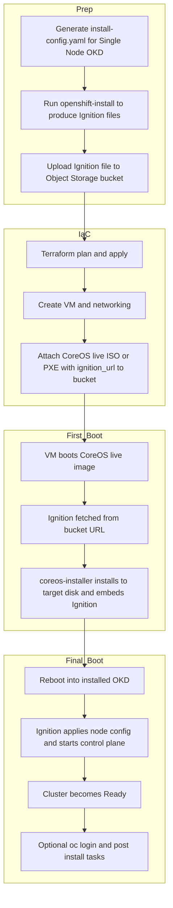
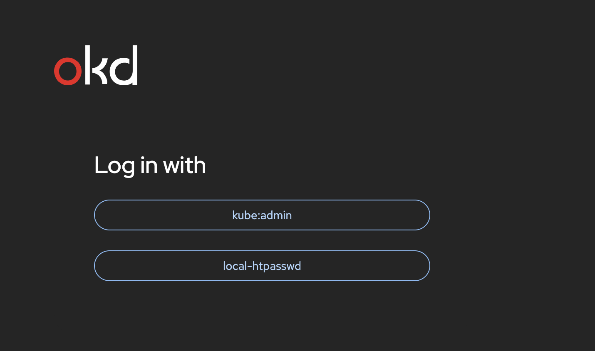

  
# 🚀 Deploying OpenShift Single Node (OKD) on Oracle Cloud Infrastructure (OCI)


## 📘 Introduction
This guide describes how to deploy a **test OpenShift platform** in **OCI** using the **open-source OKD distribution** Single Node (SNO).  
We are not using the standard OpenShift deployment procedure (discovery ISO boot), since OCI does not support direct ISO boot,but instead using the bootstrap-in-place workflow.

The installation leverages an Ignition file, a first boot on a CoreOS live image, automatic installation onto the target disk, and a final reboot into the fully installed OKD system, with the deployment of the VM managed using Terraform.

## 📋 Prerequisites
- An **OCI account** with appropriate IAM access.
- A **VCN** 
- An **Object Storage bucket** for custom image upload.  
- A **Linux build host** with:
  - Packages: `jq`, `xz`, `envsubst`, `coreos-installer`,  `podman` 
`,
- Installed tools and copy this binary in /usr/bin directory  :
  - [`terraform`](https://developer.hashicorp.com/terraform/downloads)  
  - `kubectl` or `oc` CLI  
  - `htpasswd`
  - `OCI Client`(https://www.oracle.com/database/technologies/instant-client/downloads.html)

Before starting, make sure to clone the repository:
```bash
git clone https://github.com/colussim/okd-single-node-oci-deploy/tree/v2  
cd okd-single-node-oci-deploy  
```

---

## 📊 Architecture Diagram



---


## 🛠️ Step 1 – Install Dependencies

```bash
sudo dnf install -y podman jq
```

## 🛠️ Step 2 – Prepare OKD Artifacts

Copy the example file :

Create the `.env` file :
```bash
cp config/env .env
```


📄 edit the `.env` file and update it with your own values
```bash
# ---- CLUSTER IDENTITY ----
CLUSTER_NAME="kdk8s-02"         
BASE_DOMAIN="mysqllab.com"

# OKD Version
OKD_VERSION="4.20.0-okd-scos.0"

# Arch cible: amd64 (x86) ou arm64 (Ampere A1)
ARCH="amd64"

# Network (OKD internal + network machine OCI)
CLUSTER_NETWORK_CIDR="10.128.0.0/14"
CLUSTER_NETWORK_HOSTPREFIX="23"
SERVICE_NETWORK_CIDR="172.30.0.0/16"
CIDR="10.0.30.0/24"  # CIDR on subnet OCI 

# SSH + Pull Secret

PULL_SECRET='{"auths":{"example.com":{"auth":"ZHVtbXk6ZHVtbXk="}}}'   
SSH_PUBKEY="<ssh_key>"

# ---- OCI OBJECT STORAGE / UPLOAD ----
REGION="us-ashburn-1"
BUCKET="okd-images"

# Validité des URLs présignées
PRESIGN_DAYS="365"
```

Main entries explained:

•	`CLUSTER_NAME`: The cluster name (okdk8s-02 → the full cluster domain will be okdk8s-02.mysqllab.com).

•	`BASE_DOMAIN`: The DNS domain name for your cluster (example: mysqllab.com).

•	`OKD_VERSION`:  	Replace  with the current version.
• `ARCH`:  Target CPU architecture for nodes: "amd64" (x86_64) or "arm64". 

•`CLUSTER_NETWORK_CIDR`: CIDR range used by OKD pod network (cluster internal overlay network).

•	`CLUSTER_NETWORK_HOSTPREFIX`:  Host prefix (netmask length) for pod subnets allocated to each node (controls per-node subnet size).

•	`SERVICE_NETWORK_CIDR `:  CIDR range used for Kubernetes/OKD services (ClusterIP addresses).

•	`CIDR `:  CIDR of the OCI subnet where the VM(s) will be created (network for the host/installer VMs).

•	`PULL_SECRET`: The pull secret copied from the Red Hat cluster manager (for image pulls). ❗️**Leave the PULL_SECRET value as is**, since it is not needed because we are installing OKD, which is based on open-source repositories freely accessible, unlike OpenShift which requires access to Red Hat repositories.

•	`SSH_PUBKEY`: Public SSH key that allows you to log in to the VM after install.

•	`REGION`: OCI region identifier where Object Storage bucket and resources reside (e.g., "us-ashburn-1").

•	`BUCKET`:  Name of the OCI Object Storage bucket used to store OKD/SCOS images and uploads.

•	`PRESIGN_DAYS`: Number of days presigned URLs for uploads/Downloads remain valid (expiration in days)..

Download the `OKD installer` and make it available for use by entering the following commands:
```bash
. ./.env.sh
curl -L https://github.com/okd-project/okd/releases/download/$OKD_VERSION/openshift-install-linux-$OKD_VERSION.tar.gz -o openshift-install-linux.tar.gz
```


```bash
tar zxvf openshift-install-linux.tar.gz
```

```bash
chmod +x openshift-install
sudo cp openshift-install /usr/local/bin/
```

---

## 🛠️ Step 3 – Generate OKD assets 

⚙️ Run the script : `scripts/generate_ignitions.sh`
```bash
scripts/generate_ignitions.sh
```

This script prepares the `install-config.yaml` file with variables initialized in the `.env `file, creates a directory `wokdir/<CLUSTER_NAME>`, and generates a single-node-ignition-config to produce: 
	•	bootstrap-in-place-for-live-iso.ign → the Ignition bootstrap file, including:
	•	Target disk (installation_disk)
	•	Certificates
	•	Cluster and network configuration

**⚠️ Important – Limited Lifetime of `bootstrap-in-place-for-live-iso.ign`**

The bootstrap-in-place-for-live-iso.ign Ignition file includes temporary TLS certificates required to bootstrap the cluster.
These certificates have a very short validity period .The critical* bootstrap/server *certificates (apiserver, kubelet, aggregator, etc.) have a lifespan of approximately 24 hours.


👉 Implication:
	•	If you try to reuse an old Ignition file, or if your VM starts long after the file was generated, the certificates may already be expired.
	•	In that case, the API server will fail to start properly and the installation will break with errors like:
*x509: certificate has expired or is not yet valid.*

✅ Best practice:
Always regenerate the bootstrap-in-place-for-live-iso.ign file just before starting the deployment and upload the fresh version into your bucket.
Never reuse an old .ign file.


📄 The `teraform/templates/install-config.yaml.tmpl` 
```yaml
apiVersion: v1
baseDomain: ${BASE_DOMAIN}
metadata:
  name: ${CLUSTER_NAME}
controlPlane:
  name: master
  replicas: 1
  hyperthreading: Enabled
  architecture: ${ARCH} 
compute:
 - name: worker
   replicas: 0
   hyperthreading: Enabled
   architecture:  ${ARCH}   
networking:
  networkType: OVNKubernetes
  clusterNetwork:
    - cidr: ${CLUSTER_NETWORK_CIDR} 
      hostPrefix: ${CLUSTER_NETWORK_HOSTPREFIX} 
  serviceNetwork:
    - ${SERVICE_NETWORK_CIDR} 
  machineNetwork:
  - cidr: ${CIDR} 
platform:
  none: {}
pullSecret: '${PULL_SECRET}'
sshKey: |
  ${SSH_PUBKEY}
bootstrapInPlace:
  installationDisk: /dev/sda

```

**⚠️ Make sure to save the content of the directory:**
`workdir/<CLUSTER_NAME>/auth/`

It contains critical authentication data:
	•	`kubeadmin-password` → the password for the default kubeadmin user
	•	`kubeconfig` → the cluster configuration file, required to connect with oc or kubectl
	
---

## 🛠️ Step 4 – Uploaded to an OCI Object Storage bucket, served over HTTPS

⚙️ Run the script  : `scripts/upload_to_oci.sh`
```bash
scripts/upload_to_oci.sh
```

This script uploads the Ignition configuration file `bootstrap-in-place-for-live-iso.ign` into your object storage bucket.
It will be stored under the object key:
`images/scos/<CLUSTER_NAME>/bootstrap-in-place-for-live-iso.ign`

---

## 🛠️ Step 5 – Provision initial Oracle Linux VM

In this step, we will provision an Oracle Linux VM as the initial host.
However, any Linux distribution can be used for this bootstrap phase.
This VM is only temporary: after the bootstrap and installation process, the system will reboot into Fedora/SCOS CoreOS, which becomes the final operating system for the OKD Single Node cluster.

The Terraform deployment will:
	•	Create a subnet** (example: `mysqllab.com`)
	•	Create a private DNS zone  (example: `mysqllab.com`).  

Before running the commands, position yourself inside the Terraform directory where your .tf files are located,check variables in `variables.tf`,.

📄 `variables.tf`
```hcl
// ============ General / Identity ============
variable "region" {
  type        = string
  description = "Oracle Cloud region"
  default     = "us-ashburn-1"
}

variable "compartment_ocid" {
  type        = string
  description = "Compartment OCID where resources are created"
  default     = "ocid1.compartment.oc1..xxxxxx"
}


variable "tenancy_ocid" {
  type        = string
  description = "tenancy_ocid"
  default ="ocid1.tenancy.oc1..xxxxx"
} 

// ============ Networking ============
variable "vcn_ocid" {
  type        = string
  description = "Existing VCN OCID (subnet will be created inside this VCN)"
  default     = "ocid1.vcn.oc1.iad.xxxxx"
}

variable "subnet_cidr" {
  type        = string
  description = "CIDR of the subnet to create for the SNO node (must match install-config machineNetwork)"
  default     = "10.0.30.0/24"
}

variable "subnet_dns_label" {
  type        = string
  description = "DNS label for the subnet"
  default     = "sno30"
}

variable "dns_servers" {
  type        = list(string)
  description = "Custom DNS servers for the subnet (optional)"
  default     = ["10.0.30.2"]
}

variable "create_igw" {
  type        = bool
  description = "Create an Internet Gateway for egress (if false, provide route_table_id)"
  default     = false
}

variable "route_table_id" {
  type        = string
  description = "Existing route table OCID to attach to the subnet when create_igw = false"
  default     = ""
}

variable "admin_cidr" {
  type        = string
  description = "CIDR allowed to access the node (SSH/API as needed)"
  default     = "0.0.0.0/0"
}

// Optional: attach NSGs if you have them
variable "nsg_ids" {
  type        = list(string)
  description = "Optional list of NSG OCIDs to attach to the VNIC"
  default     = []
}

// ============ Compute ============
variable "shape" {
  type        = string
  description = "Instance shape (use E5.* for amd64, A1.Flex for arm64)"
  default     = "VM.Standard.E5.Flex"
}

variable "arch" {
  type        = string
  description = "Target CPU architecture: amd64 or arm64"
  default     = "amd64"

  validation {
    condition     = contains(["amd64", "arm64"], var.arch)
    error_message = "arch must be 'amd64' or 'arm64'."
  }
}

variable "ocpus" {
  type        = number
  description = "Number of OCPUs"
  default     = 8
}

variable "memory_gbs" {
  type        = number
  description = "Memory in GB"
  default     = 32
}

variable "boot_gb" {
  type        = number
  description = "Boot volume size in GB"
  default     = 900
}

// Base Linux image (Oracle Linux/Fedora Cloud) used to run coreos-installer at first boot
variable "base_linux_image_ocid" {
  type        = string
  description = "OCID of base Linux image to boot (not SCOS). VM will reimage itself via coreos-installer."
  default     = "ocid1.image.oc1.iad.aaaaaaaazqak7q2gzmnomqpnlpqzwg27wovlo4z5beoftmfhc2h6owaowflq"
}

variable "okd_bucket_name"      { 
  type = string
  description = "okd-images"
  default="okd-images"

}

variable "okd_ignition_object"  { 
  type = string
  description = "bootstrap-in-place-for-live-iso.ign" 
  default = "images/scos/okdk8s-02/bootstrap-in-place-for-live-iso.ign"
  
}

// ============ SCOS Release ============
variable "scos_stream" {
  description = "Stream SCOS (ex: c10s)"
  type        = string
  default     = "c10s"
}

variable "scos_build" {
  description = "Build SCOS (ex: 10.0.20250628-0)"
  type        = string
  default     = "10.0.20250628-0"
}

variable "scos_arch" {
  description = "Architecture (x86_64, aarch64)"
  type        = string
  default     = "x86_64"
}

// ============ Instance Identity ============
variable "instance_name" {
  type        = string
  description = "Instance display name"
  default     = "odk02"
}

variable "hostname_label" {
  type        = string
  description = "VNIC hostname label (DNS)"
  default     = "okd02"
}

variable "node_ip" {
  type        = string
  description = "Static private IP to assign to the node (must be inside subnet_cidr)"
  default     = "10.0.30.51"
}

variable "ssh_user" {
  type        = string
  description = "Default SSH user (SCOS: 'core')"
  default     = "core"
}

variable "ssh_authorized_keys" {
  type        = string
  description = "Public SSH keys (one per line) to inject into instance metadata"
  default     = "ssh-ed25519 xxxxxxxxxxx"
}

variable "ssh_private_key" {
  type        = string
  description = "Local path to the SSH private key (if used by provisioners/scripts)"
  default     = "~/.ssh/okd-sno"
}

// ============ DNS (Private Zone: create-or-reuse) ============
variable "domain" {
  type        = string
  description = "Base domain (e.g., mysqllab.com)"
  default     = "mysqllab.com"
}

variable "cluster_subdomain" {
  type        = string
  description = "Cluster subdomain (e.g., okdk8s); FQDNs will be api.<sub>.<domain> and *.apps.<sub>.<domain>"
  default     = "okdk8s-02"
}

variable "existing_private_zone_id" {
  type        = string
  description = "If set, reuse this private DNS zone ID; if empty, Terraform creates the zone named 'domain'."
  default     = ""
}

variable "existing_private_view_id" {
  type        = string
  description = "If set, reuse this private DNS view ID; if empty, Terraform creates a new private view and attaches it to the VCN resolver."
  default     = ""
}


// ============ Kubeconfig context (futur oprtion) ============
variable "kube_context" {
  type        = string
  description = "Name to use for kubeconfig context (optional)"
  default     = "okd02"
}


// If true, Terraform will wipe any existing partitions, filesystems,
// or LVM volumes on the target disk before running the CoreOS installer.
variable "allow_wipe" {
  type        = bool
  description = "Allow the target disk to be erased BEFORE kexec"
  default     = true
}

// Block device path to install the OKD/SCOS node on.
// This should point to the raw disk (e.g. "/dev/sda") and NOT a partition (e.g. "/dev/sda3").

// The installer will repartition and format this disk according to the
// bootstrap-in-place process, so ensure it is dedicated for the cluster.
variable "installation_disk" {
  type        = string
  description = "Installation disk for bootstrapInPlace.installationDisk"
  default     = "/dev/sda"
}
```

⚙️ Run:
```bash
terraform init
terraform apply
```

After approximately 30-35 minutes, your OKD instance is deployed.👏

Example output : 
```bash
.......
null_resource.wait_console (local-exec): ⌛ console not ready (attempt #173, http='503', elapsed=1795s)
null_resource.wait_console: Still creating... [30m0s elapsed]
null_resource.wait_console (local-exec): ⌛ console not ready (attempt #174, http='503', elapsed=1805s)
null_resource.wait_console: Still creating... [30m10s elapsed]
null_resource.wait_console (local-exec): ✅ Console READY (HTTP 200) after 1815s (attempt #175)
null_resource.wait_console: Creation complete after 30m16s [id=6048789974029356612]


Apply complete! Resources: 21 added, 0 changed, 0 destroyed.

Outputs:

api_fqdn = "api.okdk8s-02.mysqllab.com"
apps_wildcard_fqdn = "*.apps.okdk8s-02.mysqllab.com"
finished_at = "2025-09-30T14:28:02Z"
sno_private_ip = "10.0.30.51"
sno_public_ip = "X.X.X.X"
sno_subnet_id = "ocid1.subnet.oc1.iad.aaa...."
ssh_core_cmd = "ssh core@193.122.141.76"
started_at = "2025-09-30T13:57:05Z"
```

You can try connecting using the following command:
```bash
ssh -i <ssh_private_key> core@<public_ip>
```

> Replace <ssh_private_key> with the private key linked to the SSH public key you added in your <.env> file, and <public_ip> with the generated public IP address.


## 🛠️ Step 6 – Configure the kubeconfig for API access

To interact with the OpenShift / Kubernetes API using *oc* or *kubectl*, you must configure your kubeconfig file on the target OKD instance.
	1.	Connect to your OKD instance as user core.
	2.	Create the hidden .kube directory in your home if it does not exist:
	
```bash
mkdir -p /var/home/core/.kube
```

Copy the generated kubeconfig from your workdir on the bootstrap machine to the OKD instance:

```bash
scp -i <ssh_private_key> workdir/<CLUSTER_NAME>/auth/kubeconfig core@<public_ip>:/var/home/core/.kube/config
```

> Replace <ssh_private_key> with the private key linked to the SSH public key you added in your <.env> file, <public_ip> with the generated public IP address and <CLUSTER_NAME> with your cluster name.

On the OKD instance, you can now test access with:
```bash
oc whoami
```

It should return `system:admin` or the user you logged in with .

**Configure the kubeconfig from your local workstation**

You can copy the kubeconfig file from two possible locations:
	•	From your installer workstation (where you created the workdir):
→ the file is located in workdir/<CLUSTER_NAME>/auth/kubeconfig.
	•	From the OKD instance itself (if you followed the previous step):
→ the file is already available at /var/home/core/.kube/config.

In both cases, you can then merge it into your local ~/.kube/config so you can interact with the cluster API from your laptop.

Copy the kubeconfig to your local workstation (example from OKD instance)
```bash
scp -i <ssh_private_key> core@<public_ip>:/var/home/core/.kube/config ~/.kube/okd-new.kubeconfig
```

 Merge with your existing kubeconfig

If you do not have a configuration file, create the `.kube` directory in your home directory and copy the file `~/okd-new.kubeconfig` to the directory as `config`.

For increased security, we will not merge contexts in case there are duplicates with the same context name and user. Instead, when running the oc or kubectl commands, specify the configuration file explicitly using the  `--kubeconfig ` parameter, for example:  

```bash
oc get nodes --kubeconfig=~/.kube/okd-new.kubeconfig 
```


---

## 🛠️ Step 7 – Access the Web Console

Update your `/etc/hosts` (on your laptop):

```text
`<public_ip>` api.okdk8s.mysqllab.com api-int.okdk8s.mysqllab.com \
console-openshift-console.apps.okdk8s.mysqllab.com \
oauth-openshift.apps.okdk8s.mysqllab.com \
*.apps.okdk8s.mysqllab.com okdk8s.mysqllab.com
```


Now that everything is set up, you can log in to the OKD web console:

Enter the following URL in your browser:
```text
https://console-openshift-console.apps..domain/?lng=en
```

Login with the temporary `kubeadmin` user (password in `workdir/auth/kubeadmin-password`).


The next step is to create an Admin user.

---

## 🛠️ Step 9 – Create an Admin User

We will create an admin user:
```bash
htpasswd -c -B users.htpasswd admin
```

Create a secret with the admin user and its password:
```bash
oc --kubeconfig=~/.kube/okd-new.kubeconfig  create secret generic htpasswd-secret --from-file=htpasswd=users.htpasswd -n openshift-config
```

Since we don't have an Identity Provider available, we will create an IdentityProvider_HTPasswd:

📄 oauth-htpasswd.yaml
```yaml
apiVersion: config.openshift.io/v1
kind: OAuth
metadata:
  name: cluster
spec:
  identityProviders:
  - name: local-htpasswd
    mappingMethod: claim
    type: HTPasswd
    htpasswd:
      fileData:
        name: htpasswd-secret
```

Apply the configuration:
```bash
oc apply -f oauth-htpasswd.yaml
```

Next, assign the cluster-admin role to our admin user:
```bash
oc --kubeconfig=~/.kube/okd-new.kubeconfig  create user admin
oc --kubeconfig=~/.kube/okd-new.kubeconfig  adm policy add-cluster-role-to-user cluster-admin admin
```

Now, you can log in to the web console with your admin user, using the provider: `local-htpasswd`.



---


## 🛠️ Step 10 – ProviderID requirement for OCI Cloud Controller Manager

By default, when running OpenShift in Single Node (SNO) mode on Oracle Cloud Infrastructure (OCI), the spec.providerID field of the Kubernetes Node object is not automatically populated.

This field is critical for the OCI Cloud Controller Manager (CCM) and the OCI CSI driver, because it allows them to map a Kubernetes Node to the corresponding OCI instance (using its OCID).

Workaround: Manually patch the Node

For single-node clusters or test environments, you can patch the Node directly with the correct OCI instance OCID:

```bash
oc --kubeconfig=~/.kube/okd-new.kubeconfig  patch node <your_node> --type=merge -p '{"spec":{"providerID":"oci://<your_vm_ocid1>"}}'
```

Verify :
```bash

oc --kubeconfig=~/.kube/okd-new.kubeconfig  get node  <your_node> -o jsonpath='{.spec.providerID}{"\n"}'

```

---

## 🧠 📏 Memory Reservation Warning Explained

If you see a warning like:

> System memory usage of 1.503G on Node `okd01` exceeds 95% of the reservation.
Reserved memory ensures system processes can function even when the node is fully
allocated and protects against workload out of memory events impacting the proper
functioning of the node.

This does **not** mean that your node has run out of physical memory.  
It means that the kubelet’s **systemReserved** memory (the slice of RAM reserved for the OS, 
kubelet, CRI-O, CNI, and other system components) is nearly full.

By default, OpenShift only reserves about **1–1.5 GiB** for system processes.  
On nodes with many pods or on a **Single Node OpenShift (SNO)** cluster, this is often 
insufficient and triggers the warning — even if plenty of memory remains available overall.

---

### Why this happens
- **Capacity** is the total memory of the node.  
- **Allocatable** is what remains for pods after subtracting system reservations.  
- On a 32 GiB node, you may see something like:
  - Capacity: ~31.3 GiB  
  - Allocatable: ~30.2 GiB  
  - Reserved: ~1.1 GiB  
- If system processes use ~1.5 GiB, the reservation is exceeded → warning appears.  

---

### How much should you reserve?

As a rule of thumb:

| Pod Density (per node) | Recommended `systemReserved.memory` | Notes |
|-------------------------|-------------------------------------|-------|
| < 50 pods              | 2–3 GiB                            | Small clusters, light workloads |
| 50–100 pods            | 4–5 GiB                            | Typical medium density |
| 100–150 pods           | 5–6 GiB                            | Heavier workloads |
| > 150 pods             | 6+ GiB                             | Tune based on monitoring |

For a **32 GiB Single Node OpenShift cluster** running around **90 pods**, the recommended settings are:

- `systemReserved.memory = 5Gi`  
- `kubeReserved.memory   = 1Gi`

This leaves ~26 GiB available for workloads, while ensuring system components are not starved.  


### The solution
Increase the kubelet’s memory reservations so that system processes have more headroom.

For a **32 GiB Single Node OpenShift cluster** running around **90 pods**, a good baseline is:

- `systemReserved.memory = 5Gi`  
- `kubeReserved.memory   = 1Gi`

This leaves ~26 GiB available for workloads, while ensuring system components are not starved.  

📄 increase-system-reserved-master.yaml:

```yaml
apiVersion: machineconfiguration.openshift.io/v1
kind: KubeletConfig
metadata:
  name: increase-system-reserved-master
spec:
  machineConfigPoolSelector:
    matchLabels:
      pools.operator.machineconfiguration.openshift.io/master: ""
  kubeletConfig:
    systemReserved:
      cpu: "500m"
      memory: "5Gi"
      ephemeral-storage: "1Gi"
    kubeReserved:
      cpu: "500m"
      memory: "1Gi"
      ephemeral-storage: "1Gi"
    evictionHard:
      "memory.available": "500Mi"
      "nodefs.available": "10%"
```

Apply the configuration:

```bash
oc --kubeconfig=~/.kube/okd-new.kubeconfig  apply -f increase-system-reserved-master.yaml
oc --kubeconfig=~/.kube/okd-new.kubeconfig  get mcp master
```

> ⚠️ On SNO, this change targets the master MachineConfigPool.
Applying it will reboot the single node, making the cluster temporarily unavailable until it comes back online.

**Summary**

- The warning is about reserved system memory, not total memory.
- On SNO, reservations are applied via the master MCP.
- Increase systemReserved (e.g. 5 GiB on a 32 GiB node with ~90 pods) to prevent the alert.
- Adjust values according to your workload density and node capacity.

---

## 🎉 Conclusion
With this procedure, we successfully deployed an OKD Single Node (SNO) cluster on Oracle Cloud Infrastructure (OCI).
This approach is well suited for testing, learning, and proof-of-concepts.
For production-grade workloads, further steps would be needed such as:
- scaling to multi-node clusters,
- integrating persistent storage and load balancing,
- configuring security, monitoring, and backup.

Overall, this guide demonstrates that OCI can serve as a flexible environment for OKD/OpenShift experimentation, while leaving room to evolve towards more advanced deployments.

---

## 🧰 Troubleshooting

The following commands are useful when diagnosing issues:

### Accessing the host node
```bash
oc --kubeconfig=~/.kube/okd-new.kubeconfig  debug node/<node>
chroot /host
```

This will give you a shell directly on the node’s host operating system. From there you can use standard Linux tools to investigate system-level problems.

---

## ⚠️ Limitation with the OCI CSI Driver in iSCSI Mode

clusters running OKD/OpenShift (or Kubernetes distributions using OVN-Kubernetes as the network plugin).

This limitation is caused by a network address conflict:
	•	OCI exposes iSCSI targets through a reserved link-local network 169.254.0.0/16, which is hard-coded and non-configurable in OCI.
	•	OVN-Kubernetes also uses the same 169.254.0.0/16 space internally for node-to-node and gateway communication.
	•	As a result, nodes cannot establish stable routes to the OCI iSCSI targets.
In practice, mount attempts fail with errors such as:

```bash
iscsi: error logging in target: exit status 8
rpc error: code = Internal desc = context deadline exceeded
```

🔒 Consequence:
Persistent volumes provisioned through the driver
blockvolume.csi.oraclecloud.com cannot be mounted by pods when using
attachmentType: "iscsi" in an OKD or OVN-based Kubernetes environment.

⸻

✅ Recommended Workarounds
	•	Use attachmentType: "paravirtualized" if supported by your workloads.
	•	Alternatively, deploy an external storage backend, such as a Ceph cluster or any iSCSI/NVMe solution using a dedicated non-link-local network.
	•	Expose this storage through a compatible CSI driver (e.g., Ceph RBD, NFS, or another vendor driver).

⸻

🧭 Recommended Topology Example

```text
+----------------------+         +----------------------+
|   OKD / OpenShift    |         |     Ceph Cluster     |
|   Node (10.0.30.x)   | <-----> |  iSCSI/NVMe Network  |
|   OVN link-local     |         |   (10.0.40.x VLAN)   |
|   169.254.0.0/16     |         |  No link-local use   |
+----------------------+         +----------------------+
```
This approach isolates iSCSI or block storage traffic on a dedicated subnet
(e.g. 10.0.40.0/24), fully compatible with OVN, and enables reliable and multi-node persistent volumes using the Ceph CSI driver or similar.


**⚠️TL;DR**

> The OCI CSI iSCSI mode cannot be used on OpenShift/OVN because both rely on 169.254.0.0/16.
Use a dedicated storage backend (e.g., Ceph, NFS, NVMe) on a separate subnet instead.


---


## ⏭️ Next Steps
- [`Deploying OCI Cloud Controller Manager (CCM)`](Deploying_OCI_Cloud_Controller_Manager)  
- [`Configure IAM for OCI CSI Driver and CCM`](Configuring_IAM_OCI_CSI_Driver)  
- [`Deploy `oci-csi` driver for persistent storage`](Deploying_OCI_Block_Volume_CSI_Driver )  


---

## 📚 References

- [Oracle Instant Client Downloads](https://www.oracle.com/database/technologies/instant-client/downloads.html)
- [OKD installation](https://docs.okd.io/latest/installing/overview/)
- [Installing OpenShift on a single node ](https://docs.okd.io/latest/installing/installing_sno/install-sno-installing-sno.html)
- [pull secret from Red Hat OpenShift Cluster Manager](https://console.redhat.com/openshift/install/pull-secret)
- [Which amount of CPU and memory are recommended to reserve for the system in OpenShift](https://access.redhat.com/solutions/5843241)
- [Install Terraform](https://developer.hashicorp.com/terraform/install)
---
